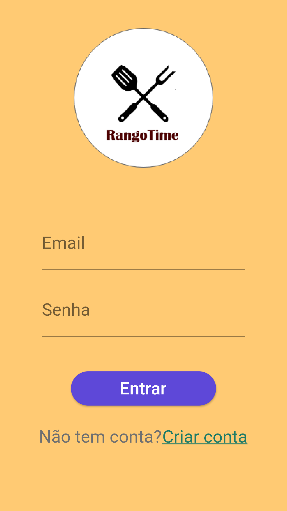
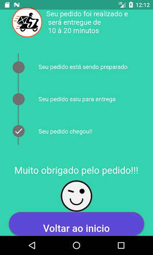
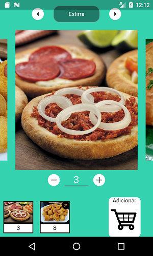
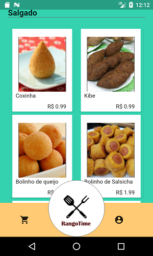

# rango_time_app

A new Flutter project.

<h4>An Online Snack Delivery App</h4>

   

<h3>Functionalities</h3>
<ul>
<li>User Validation</li>
<li>Selection and Exclusion of snacks</li>
<li>Delivery, Pickup and Scheduling Snacks</li>
</ul>

<h3>Skills involved</h3>
<ul>
<li>Firebase</li>
<li>Mobx</li>
<li>Provider</li>
<li>Animations</li>
<li>Field validation</li>
</ul>

<h2>Feel free to make any change requests</h2>
